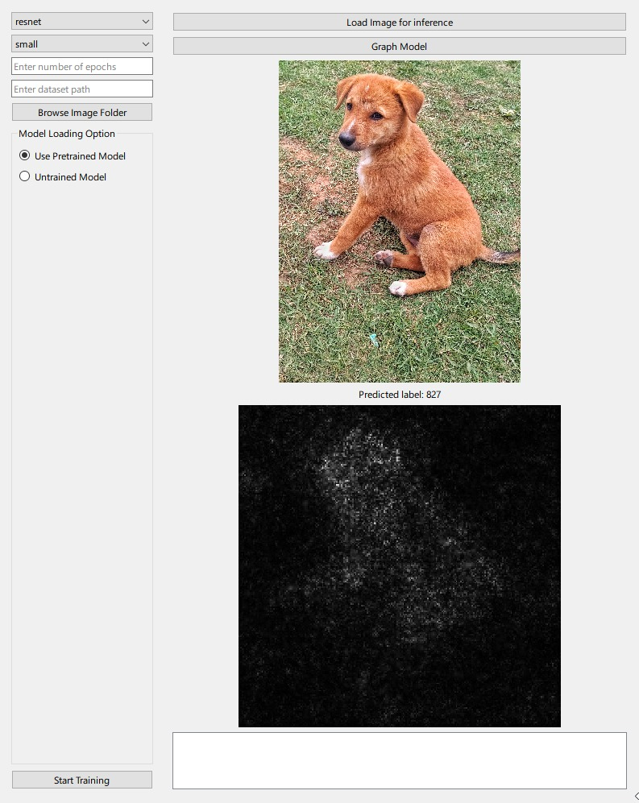

For Currently Working UI in PySide simply `python PyUI/App.py`

- Load data and train works
- inference and saliency maps works
- model graphing works but doesnt scale well for large models
- fixes : Need to log status to UI, No Customisable Models yet
- issues : Graphing model doesnt work on windows as graphviz isnt pre installed.  install from `https://graphviz.org/download/`

-------------------------------------------------------------------------------------
as for FastApi

uvicorn main:api from endpont/

check endpoints at http://127.0.0.1:8000/docs
TODO: need to fix the endpoints for an actual deployment

these can be used in ui then

--------------------------------------------------------------------------------------
eg. ui
ImagePipeline has the react + TS UI, resolve dependencies by npm install. 
then run using npm run dev.
- need to fix handling path load, model load and build to be able to also choose size 

flutter ui doesn't work yet

